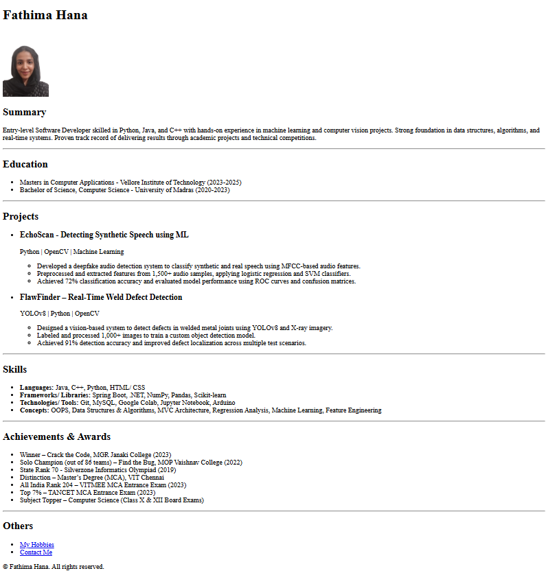

# Online Resume – Fathima Hana

HTML | Web Development | Personal Branding

---

## Overview

This is a personal website that highlights my journey as a software developer. The main page presents my background, education, technical skills, and project work. Additional pages provide insights into my hobbies and contact information.

---

## Tech  Stack

- *HTML5* – Semantic tags for structured layout
- *Image Handling* – Embedded local image for profile
- (CSS and JavaScript to be added in future versions)

---

## Key  Features

- One-page resume layout using semantic HTML
- Internal links to hobbies and contact sections
- Organized presentation of projects, skills, and awards
- Easily extendable with CSS and JavaScript for future updates

---

## File Structure
`online-resume`/ 
│ 
├── `index.html` # Main resume page 
├── `hobbies.html`  
├── `contact.html`  
├── `passport photo.jpg`  
└── `README.md`  

---

## Page Descriptions

- **index.html**  
  Contains the main resume content including profile summary, education, project highlights, skills, and achievements.

- **hobbies.html**  
  Lists personal interests such as teaching, baking, debating, and public speaking.

- **contact.html**  
  Provides contact details including phone number, email, and address.

---

## How to Run

1. Clone or download the repository.
2. Open `index.html` in any modern web browser.
3. Ensure all files (images and linked HTML pages) remain in the same directory.

---

## Live Website

[https://fathimahana-ks.github.io/online-resume/](https://fathimahana-ks.github.io/online-resume/)

---

## Preview

---

## Contact Me

**Fathima Hana**  
📧 [fathimahanaks@gmail.com](mailto:fathimahanaks@gmail.com)  
🔗 [LinkedIn](https://www.linkedin.com/in/fathimahana/)

